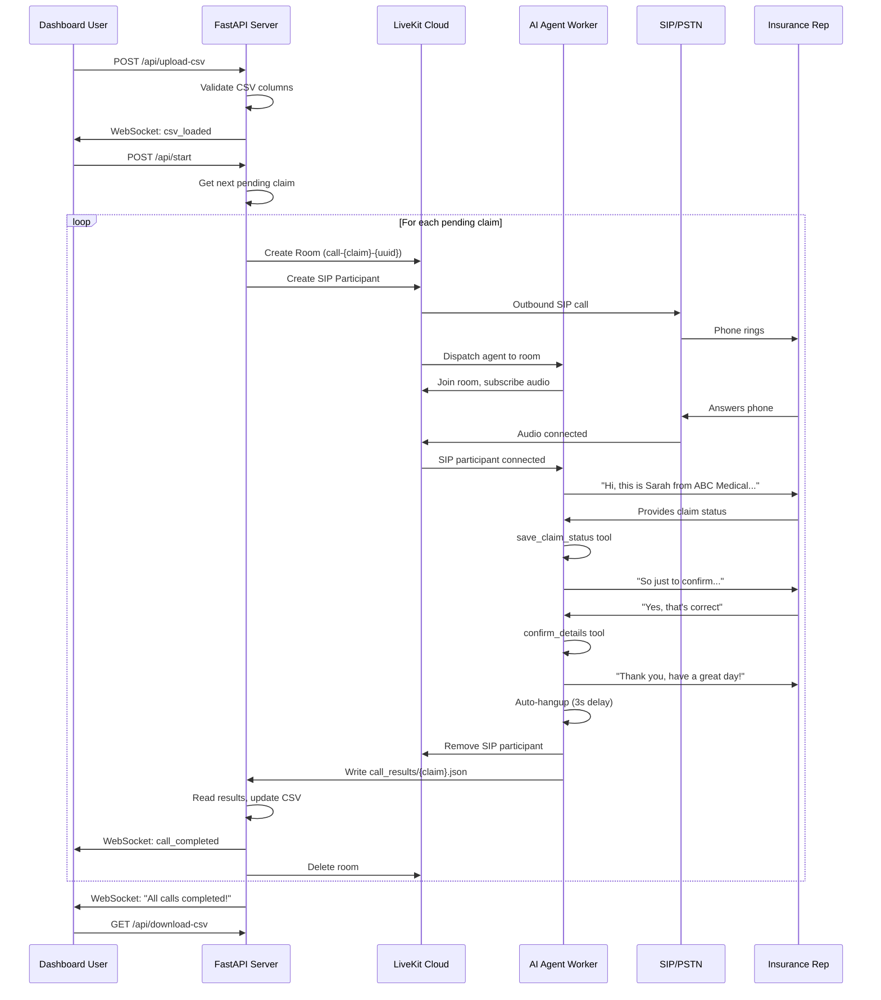

# Call Flow Documentation

## End-to-End Sequence



## Agent Conversation Phases

### Phase 1: Introduction
The agent greets the rep and confirms they've reached the claims department.

> "Hi, this is Sarah from ABC Medical Group. Am I speaking with the claims department?"

### Phase 2: Identify Claim
The agent provides the minimum claim info needed to look it up.

> "I'm calling to check on a claim for John Smith, claim number CLM-2025-001."

Additional details (DOS, CPT, provider, NPI) are only given if the rep asks.

### Phase 3: Collect Status
The agent asks ONE follow-up question at a time, acknowledging each answer:

1. Claim status (approved/denied/pending/in-review)
2. Approved amount (if applicable)
3. Payment date
4. Reference number
5. Denial reason / appeal deadline (if denied)

### Phase 4: Confirmation
After collecting all info, the agent calls `save_claim_status`, then reads back a summary:

> "So just to confirm — approved for $14,500, payment on April 15th, reference REF-123456. Does that all sound right?"

If the rep corrects anything, the agent updates via `save_claim_status` and re-summarizes.

### Phase 5: Closing
Once the rep confirms, the agent calls `confirm_details` and says goodbye:

> "Thank you so much for your help. Have a great day!"

3 seconds later, auto-hangup removes the SIP participant from the room.

## Agent Tools

### `save_claim_status`
Called after collecting claim info from the rep.

| Parameter | Type | Required | Description |
|-----------|------|----------|-------------|
| `claim_result` | string | Yes | approved/denied/pending/in-review/unknown |
| `approved_amount` | string | No | Dollar amount if approved |
| `denial_reason` | string | No | Reason if denied |
| `payment_date` | string | No | Expected/actual payment date |
| `appeal_deadline` | string | No | Appeal deadline if denied |
| `reference_number` | string | No | Insurance reference number |
| `notes` | string | No | Additional notes |

### `confirm_details`
Called after the rep explicitly confirms the summary is correct. No parameters.

### `mark_unable_to_verify`
Called when the claim cannot be verified (wrong department, claim not found, etc.).

| Parameter | Type | Required | Description |
|-----------|------|----------|-------------|
| `reason` | string | Yes | Why verification failed |

## DTMF Handling

The system listens for DTMF tone `1` as an alternative confirmation method:

- `sip_dtmf_received` event with digit `"1"` sets `confirmed = True`
- `participant_attributes_changed` with `sip.dtmf = "1"` also sets confirmed

## Error Scenarios

| Scenario | Detection | Result |
|----------|-----------|--------|
| SIP call fails to connect | `make_sip_call` returns False | `call_status = failed` |
| No answer / timeout | Room disappears or `CALL_TIMEOUT` reached | `call_status = no-answer` |
| Wrong department | Agent uses `mark_unable_to_verify` | `claim_result = unknown` |
| Claim not found | Agent uses `mark_unable_to_verify` | `claim_result = unknown` |
| Agent crash | Exception in `process_single_call` | `call_status = failed` |
| Rep hangs up mid-call | Session closes, partial results saved | Results may be incomplete |

## Auto-Hangup Logic

Located in `agent_worker.py::auto_hangup_after_goodbye`:

1. Triggered when agent says a goodbye phrase AND `confirmed = True`
2. Goodbye phrases: "great day", "bye", "goodbye", "take care"
3. Waits 3 seconds (to let TTS finish speaking)
4. Removes SIP participant from room via LiveKit API
5. Closes agent session
6. Results JSON is written before session close

## Data Flow

```
CSV Upload
    │
    ▼
CallManager.load_csv()
    │ rows stored in memory
    ▼
call_processing_loop()
    │ get_next_pending()
    ▼
process_single_call()
    │ create room + SIP call
    ▼
Agent entrypoint()
    │ conversation + tool calls
    │ writes call_results/{claim}.json
    ▼
wait_for_call_completion()
    │ polls for results file
    ▼
CallManager.update_row()
    │ atomic CSV write
    ▼
CallManager.save_transcript()
    │ writes transcripts/{claim}.txt
    ▼
broadcast() → WebSocket → Dashboard
```

## Room Lifecycle

1. **Created** by `main.py::make_sip_call` with `empty_timeout=300s`
2. **Populated** by SIP participant ("insurance-rep") and AI agent
3. **Active** during the conversation
4. **Monitored** by transcript relay (separate room connection)
5. **Cleaned up** by `main.py::process_single_call` after results are captured
6. **Auto-deleted** by LiveKit if empty for 300s (safety net)
